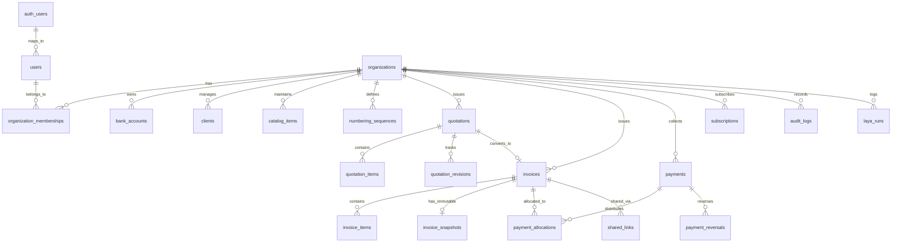

# InvoiceFlow — Production SaaS PostgreSQL Database Schema

**Date:** 6 October 2026  
**Auditor:** Antigravity Engineering Agent  
**PRD Version:** 1.0  
**Target Engine:** Supabase-Managed PostgreSQL 17 with Row-Level Security (RLS) & Kysely Compatibility

---

## 1. Schema Design Principles & Role Segregation

1. **Role Privilege Segregation:**
   - **Migration Role (`invoiceflow_migrator` / `postgres`):** Admin role executing DDL migrations and schema changes. Never used by runtime application services.
   - **Runtime Application Role (`invoiceflow_app` / `authenticated`):** Restricted application role with `NOSUPERUSER NOBYPASSRLS NOCREATEDB NOCREATEROLE`. Connects from the Kysely `pg.Pool` and is strictly bound by RLS policies.
2. **Fail-Closed Row-Level Security:** Every tenant-owned table enables RLS. Policies check `current_setting('app.current_org_id', true)`. If the context is unset, queries evaluate to false and return **0 rows**.
3. **Currency-Aware Exact Monetary Scale:** Rates, unit quantities, and monetary totals use `NUMERIC(18, 4)`. This accommodates:
   - 0-decimal currencies: JPY, KRW
   - 2-decimal currencies: USD, EUR, INR, AED, SAR
   - 3-decimal currencies: KWD, BHD, OMR
   No binary floating-point numbers (`FLOAT`, `DOUBLE PRECISION`) are permitted.
4. **Historical Document Immutability:** Foreign keys reference parent commercial entities with `ON DELETE RESTRICT` to prevent cascading deletions. Issued invoice states are frozen in `invoice_snapshots`.
5. **Integrated Background Queues:** Background jobs are stored and managed directly in PostgreSQL via `pg-boss` (`pgboss` schema), eliminating external Redis cluster dependencies.

---

## 2. Entity-Relationship Overview



---

## 3. Database Role Setup & DDL Specification

### 3.1. Role Setup & Extensions (Executed by Migrator)

```sql
-- Extensions
CREATE EXTENSION IF NOT EXISTS "uuid-ossp";
CREATE EXTENSION IF NOT EXISTS "pgcrypto";

-- Create non-superuser runtime role if not managed by Supabase
DO $$
BEGIN
    IF NOT EXISTS (SELECT FROM pg_catalog.pg_roles WHERE rolname = 'invoiceflow_app') THEN
        CREATE ROLE invoiceflow_app WITH LOGIN PASSWORD 'secure_app_password' NOSUPERUSER NOBYPASSRLS NOCREATEDB NOCREATEROLE;
    END IF;
END $$;
```

---

### 3.2. Identity, Tenancy & Memberships (Supabase Auth Integration)

```sql
-- Public Users Profile Table (Maps to Supabase auth.users)
CREATE TABLE users (
    id UUID PRIMARY KEY,                      -- Matches auth.users.id
    email VARCHAR(255) NOT NULL UNIQUE,
    full_name VARCHAR(150) NOT NULL,
    created_at TIMESTAMPTZ NOT NULL DEFAULT NOW(),
    updated_at TIMESTAMPTZ NOT NULL DEFAULT NOW()
);

-- Organizations Table
CREATE TABLE organizations (
    id UUID PRIMARY KEY DEFAULT gen_random_uuid(),
    legal_name VARCHAR(200) NOT NULL,
    display_name VARCHAR(200) NOT NULL,
    business_country VARCHAR(2) NOT NULL,      -- ISO 3166-1 alpha-2 (e.g. 'IN', 'US', 'AE')
    tax_identifier VARCHAR(100),               -- e.g. GSTIN, VAT, EIN
    address_line1 VARCHAR(255) NOT NULL,
    address_line2 VARCHAR(255),
    city VARCHAR(100) NOT NULL,
    state_province VARCHAR(100),
    postal_code VARCHAR(20) NOT NULL,
    contact_email VARCHAR(255) NOT NULL,
    contact_phone VARCHAR(50),
    logo_url TEXT,
    timezone VARCHAR(50) NOT NULL DEFAULT 'UTC', -- e.g. 'Asia/Kolkata'
    locale VARCHAR(20) NOT NULL DEFAULT 'en-US',
    document_language VARCHAR(10) NOT NULL DEFAULT 'en',
    base_currency VARCHAR(3) NOT NULL DEFAULT 'USD',      -- ISO 4217
    reporting_currency VARCHAR(3) NOT NULL DEFAULT 'USD', -- ISO 4217
    financial_year_start_month SMALLINT NOT NULL DEFAULT 1,
    created_at TIMESTAMPTZ NOT NULL DEFAULT NOW(),
    updated_at TIMESTAMPTZ NOT NULL DEFAULT NOW()
);

-- Organization Memberships Table
CREATE TYPE membership_role AS ENUM ('OWNER', 'ADMIN', 'FINANCE', 'VIEWER');

CREATE TABLE organization_memberships (
    id UUID PRIMARY KEY DEFAULT gen_random_uuid(),
    organization_id UUID NOT NULL REFERENCES organizations(id) ON DELETE CASCADE,
    user_id UUID NOT NULL REFERENCES users(id) ON DELETE CASCADE,
    role membership_role NOT NULL DEFAULT 'VIEWER',
    created_at TIMESTAMPTZ NOT NULL DEFAULT NOW(),
    updated_at TIMESTAMPTZ NOT NULL DEFAULT NOW(),
    CONSTRAINT uq_user_organization UNIQUE (organization_id, user_id)
);
CREATE INDEX idx_memberships_user ON organization_memberships(user_id);
```

---

### 3.3. Banking & Payment Instructions

```sql
CREATE TYPE payment_rail AS ENUM ('WIRE_ACH', 'SEPA', 'UPI', 'SWIFT', 'LOCAL_TRANSFER');

CREATE TABLE bank_accounts (
    id UUID PRIMARY KEY DEFAULT gen_random_uuid(),
    organization_id UUID NOT NULL REFERENCES organizations(id) ON DELETE CASCADE,
    account_holder_name VARCHAR(200) NOT NULL,
    bank_name VARCHAR(200) NOT NULL,
    account_number_encrypted TEXT NOT NULL,     -- AES-256-GCM encrypted
    account_number_last4 VARCHAR(4) NOT NULL,
    routing_identifier VARCHAR(100),           -- IFSC, BIC/SWIFT, Sort Code
    iban_encrypted TEXT,                       -- AES-256-GCM encrypted
    supported_currencies VARCHAR(3)[] NOT NULL,
    payment_rail payment_rail NOT NULL DEFAULT 'LOCAL_TRANSFER',
    is_active BOOLEAN NOT NULL DEFAULT TRUE,
    created_at TIMESTAMPTZ NOT NULL DEFAULT NOW(),
    updated_at TIMESTAMPTZ NOT NULL DEFAULT NOW()
);
CREATE INDEX idx_bank_accounts_org ON bank_accounts(organization_id);
```

---

### 3.4. Clients & Product Catalog

```sql
CREATE TABLE clients (
    id UUID PRIMARY KEY DEFAULT gen_random_uuid(),
    organization_id UUID NOT NULL REFERENCES organizations(id) ON DELETE CASCADE,
    name VARCHAR(200) NOT NULL,
    company_name VARCHAR(200),
    email VARCHAR(255) NOT NULL,
    phone VARCHAR(50),
    billing_address_line1 VARCHAR(255),
    billing_address_line2 VARCHAR(255),
    billing_city VARCHAR(100),
    billing_state VARCHAR(100),
    billing_postal_code VARCHAR(20),
    billing_country VARCHAR(2) NOT NULL,
    tax_identifier VARCHAR(100),
    preferred_currency VARCHAR(3) NOT NULL DEFAULT 'USD',
    preferred_language VARCHAR(10) NOT NULL DEFAULT 'en',
    payment_terms_days INTEGER NOT NULL DEFAULT 14,
    notes TEXT,
    is_archived BOOLEAN NOT NULL DEFAULT FALSE,
    created_at TIMESTAMPTZ NOT NULL DEFAULT NOW(),
    updated_at TIMESTAMPTZ NOT NULL DEFAULT NOW()
);
CREATE INDEX idx_clients_org_archived ON clients(organization_id, is_archived);
CREATE INDEX idx_clients_search ON clients USING gin(to_tsvector('english', name || ' ' || coalesce(company_name, '') || ' ' || email));

CREATE TABLE catalog_items (
    id UUID PRIMARY KEY DEFAULT gen_random_uuid(),
    organization_id UUID NOT NULL REFERENCES organizations(id) ON DELETE CASCADE,
    title VARCHAR(200) NOT NULL,
    description TEXT,
    unit_label VARCHAR(50) NOT NULL DEFAULT 'unit',
    unit_rate NUMERIC(18, 4) NOT NULL CHECK (unit_rate >= 0),
    currency VARCHAR(3) NOT NULL DEFAULT 'USD',
    tax_rate_percent NUMERIC(5, 2) NOT NULL DEFAULT 0.00 CHECK (tax_rate_percent >= 0),
    is_active BOOLEAN NOT NULL DEFAULT TRUE,
    created_at TIMESTAMPTZ NOT NULL DEFAULT NOW(),
    updated_at TIMESTAMPTZ NOT NULL DEFAULT NOW()
);
CREATE INDEX idx_catalog_org_active ON catalog_items(organization_id, is_active);
```

---

### 3.5. Atomic Numbering Sequences

```sql
CREATE TABLE numbering_sequences (
    id UUID PRIMARY KEY DEFAULT gen_random_uuid(),
    organization_id UUID NOT NULL REFERENCES organizations(id) ON DELETE CASCADE,
    document_type VARCHAR(20) NOT NULL,       -- 'INVOICE', 'QUOTATION'
    prefix VARCHAR(20) NOT NULL,               -- 'INV', 'QT'
    financial_year VARCHAR(10) NOT NULL,       -- '2026-2027', '2026'
    current_sequence INTEGER NOT NULL DEFAULT 0,
    created_at TIMESTAMPTZ NOT NULL DEFAULT NOW(),
    updated_at TIMESTAMPTZ NOT NULL DEFAULT NOW(),
    CONSTRAINT uq_org_doc_seq UNIQUE (organization_id, document_type, prefix, financial_year)
);
CREATE INDEX idx_sequences_org ON numbering_sequences(organization_id);
```

---

### 3.6. Quotations & Revisions

```sql
CREATE TYPE quotation_status AS ENUM ('Draft', 'Sent', 'Accepted', 'Declined', 'Expired', 'Cancelled', 'Converted');

CREATE TABLE quotations (
    id UUID PRIMARY KEY DEFAULT gen_random_uuid(),
    organization_id UUID NOT NULL REFERENCES organizations(id) ON DELETE RESTRICT,
    client_id UUID NOT NULL REFERENCES clients(id) ON DELETE RESTRICT,
    quotation_number VARCHAR(50) NOT NULL,
    current_revision INTEGER NOT NULL DEFAULT 1,
    status quotation_status NOT NULL DEFAULT 'Draft',
    currency VARCHAR(3) NOT NULL,
    currency_exponent SMALLINT NOT NULL DEFAULT 2, -- 0 for JPY, 2 for USD/INR, 3 for KWD
    issue_date DATE NOT NULL,
    valid_until DATE NOT NULL,
    subtotal_amount NUMERIC(18, 4) NOT NULL DEFAULT 0.0000,
    discount_amount NUMERIC(18, 4) NOT NULL DEFAULT 0.0000,
    tax_amount NUMERIC(18, 4) NOT NULL DEFAULT 0.0000,
    total_amount NUMERIC(18, 4) NOT NULL DEFAULT 0.0000,
    notes TEXT,
    terms_conditions TEXT,
    template_id VARCHAR(50) NOT NULL DEFAULT 'tpl_standard_v1',
    converted_invoice_id UUID,
    created_by UUID REFERENCES users(id),
    created_at TIMESTAMPTZ NOT NULL DEFAULT NOW(),
    updated_at TIMESTAMPTZ NOT NULL DEFAULT NOW(),
    CONSTRAINT uq_org_quotation_number UNIQUE (organization_id, quotation_number)
);
CREATE INDEX idx_quotations_org_status ON quotations(organization_id, status);

CREATE TABLE quotation_items (
    id UUID PRIMARY KEY DEFAULT gen_random_uuid(),
    quotation_id UUID NOT NULL REFERENCES quotations(id) ON DELETE CASCADE,
    catalog_item_id UUID REFERENCES catalog_items(id) ON DELETE SET NULL,
    description TEXT NOT NULL,
    quantity NUMERIC(18, 4) NOT NULL CHECK (quantity > 0),
    unit_rate NUMERIC(18, 4) NOT NULL CHECK (unit_rate >= 0),
    discount_percentage NUMERIC(5, 2) NOT NULL DEFAULT 0.00,
    discount_amount NUMERIC(18, 4) NOT NULL DEFAULT 0.0000,
    tax_rate_percentage NUMERIC(5, 2) NOT NULL DEFAULT 0.00,
    tax_amount NUMERIC(18, 4) NOT NULL DEFAULT 0.0000,
    line_total NUMERIC(18, 4) NOT NULL,
    sort_order SMALLINT NOT NULL DEFAULT 0
);
CREATE INDEX idx_quotation_items_qid ON quotation_items(quotation_id);

CREATE TABLE quotation_revisions (
    id UUID PRIMARY KEY DEFAULT gen_random_uuid(),
    quotation_id UUID NOT NULL REFERENCES quotations(id) ON DELETE CASCADE,
    revision_number INTEGER NOT NULL,
    snapshot_payload JSONB NOT NULL,
    client_action_notes TEXT,
    created_at TIMESTAMPTZ NOT NULL DEFAULT NOW(),
    CONSTRAINT uq_quotation_revision UNIQUE (quotation_id, revision_number)
);
```

---

### 3.7. Invoices, Line Items & Immutable Snapshots

```sql
CREATE TYPE invoice_doc_status AS ENUM ('Draft', 'Issued', 'Voided');
CREATE TYPE invoice_pay_status AS ENUM ('Unpaid', 'Partially_Paid', 'Paid', 'Overpaid');

CREATE TABLE invoices (
    id UUID PRIMARY KEY DEFAULT gen_random_uuid(),
    organization_id UUID NOT NULL REFERENCES organizations(id) ON DELETE RESTRICT,
    client_id UUID NOT NULL REFERENCES clients(id) ON DELETE RESTRICT,
    source_quotation_id UUID REFERENCES quotations(id) ON DELETE SET NULL,
    invoice_number VARCHAR(50),                -- Assigned at issuance: INV-2026-00042
    document_status invoice_doc_status NOT NULL DEFAULT 'Draft',
    payment_status invoice_pay_status NOT NULL DEFAULT 'Unpaid',
    currency VARCHAR(3) NOT NULL,
    currency_exponent SMALLINT NOT NULL DEFAULT 2, -- 0 for JPY, 2 for USD/INR, 3 for KWD
    issue_date DATE NOT NULL,
    due_date DATE NOT NULL,
    subtotal_amount NUMERIC(18, 4) NOT NULL DEFAULT 0.0000,
    discount_amount NUMERIC(18, 4) NOT NULL DEFAULT 0.0000,
    tax_amount NUMERIC(18, 4) NOT NULL DEFAULT 0.0000,
    total_amount NUMERIC(18, 4) NOT NULL DEFAULT 0.0000,
    amount_paid NUMERIC(18, 4) NOT NULL DEFAULT 0.0000 CHECK (amount_paid >= 0),
    balance_due NUMERIC(18, 4) NOT NULL DEFAULT 0.0000 CHECK (balance_due >= 0),
    bank_account_id UUID REFERENCES bank_accounts(id) ON DELETE RESTRICT,
    notes TEXT,
    terms_conditions TEXT,
    template_id VARCHAR(50) NOT NULL DEFAULT 'tpl_standard_v1',
    template_version VARCHAR(20) NOT NULL DEFAULT '1.0.0',
    calculation_version VARCHAR(20) NOT NULL DEFAULT 'CALC_V1',
    pdf_url TEXT,
    pdf_generated_at TIMESTAMPTZ,
    issued_at TIMESTAMPTZ,
    voided_at TIMESTAMPTZ,
    void_reason TEXT,
    created_by UUID REFERENCES users(id),
    created_at TIMESTAMPTZ NOT NULL DEFAULT NOW(),
    updated_at TIMESTAMPTZ NOT NULL DEFAULT NOW(),
    CONSTRAINT uq_org_invoice_num UNIQUE (organization_id, invoice_number)
);
CREATE INDEX idx_invoices_org_doc_status ON invoices(organization_id, document_status);
CREATE INDEX idx_invoices_org_pay_status ON invoices(organization_id, payment_status);
CREATE INDEX idx_invoices_client ON invoices(organization_id, client_id);
CREATE INDEX idx_invoices_due_date ON invoices(organization_id, due_date);

CREATE TABLE invoice_items (
    id UUID PRIMARY KEY DEFAULT gen_random_uuid(),
    invoice_id UUID NOT NULL REFERENCES invoices(id) ON DELETE CASCADE,
    catalog_item_id UUID REFERENCES catalog_items(id) ON DELETE SET NULL,
    description TEXT NOT NULL,
    quantity NUMERIC(18, 4) NOT NULL CHECK (quantity > 0),
    unit_rate NUMERIC(18, 4) NOT NULL CHECK (unit_rate >= 0),
    discount_percentage NUMERIC(5, 2) NOT NULL DEFAULT 0.00,
    discount_amount NUMERIC(18, 4) NOT NULL DEFAULT 0.0000,
    tax_rate_percentage NUMERIC(5, 2) NOT NULL DEFAULT 0.00,
    tax_amount NUMERIC(18, 4) NOT NULL DEFAULT 0.0000,
    line_total NUMERIC(18, 4) NOT NULL,
    sort_order SMALLINT NOT NULL DEFAULT 0
);
CREATE INDEX idx_invoice_items_iid ON invoice_items(invoice_id);

CREATE TABLE invoice_snapshots (
    id UUID PRIMARY KEY DEFAULT gen_random_uuid(),
    invoice_id UUID NOT NULL UNIQUE REFERENCES invoices(id) ON DELETE RESTRICT,
    organization_id UUID NOT NULL REFERENCES organizations(id) ON DELETE RESTRICT,
    snapshot_payload JSONB NOT NULL,
    checksum_sha256 VARCHAR(64) NOT NULL,
    created_at TIMESTAMPTZ NOT NULL DEFAULT NOW()
);
CREATE INDEX idx_invoice_snapshots_org ON invoice_snapshots(organization_id);
```

---

### 3.8. Payments, Allocations & Reversals Ledger

```sql
CREATE TYPE payment_source AS ENUM ('MANUAL', 'STRIPE', 'RAZORPAY', 'TABBY', 'BANK_IMPORT');
CREATE TYPE payment_status AS ENUM ('PENDING', 'CONFIRMED', 'REVERSED', 'FAILED');

CREATE TABLE payments (
    id UUID PRIMARY KEY DEFAULT gen_random_uuid(),
    organization_id UUID NOT NULL REFERENCES organizations(id) ON DELETE RESTRICT,
    amount NUMERIC(18, 4) NOT NULL CHECK (amount > 0),
    currency VARCHAR(3) NOT NULL,
    currency_exponent SMALLINT NOT NULL DEFAULT 2,
    source payment_source NOT NULL,
    status payment_status NOT NULL DEFAULT 'CONFIRMED',
    payment_method VARCHAR(50) NOT NULL,
    payment_date DATE NOT NULL,
    reference_number VARCHAR(100),
    gateway_transaction_id VARCHAR(255),
    gateway_event_id VARCHAR(255),
    notes TEXT,
    created_by UUID REFERENCES users(id),
    created_at TIMESTAMPTZ NOT NULL DEFAULT NOW(),
    updated_at TIMESTAMPTZ NOT NULL DEFAULT NOW()
);
CREATE INDEX idx_payments_org_date ON payments(organization_id, payment_date);

CREATE TABLE payment_allocations (
    id UUID PRIMARY KEY DEFAULT gen_random_uuid(),
    payment_id UUID NOT NULL REFERENCES payments(id) ON DELETE RESTRICT,
    invoice_id UUID NOT NULL REFERENCES invoices(id) ON DELETE RESTRICT,
    organization_id UUID NOT NULL REFERENCES organizations(id) ON DELETE RESTRICT,
    amount_allocated NUMERIC(18, 4) NOT NULL CHECK (amount_allocated > 0),
    allocated_at TIMESTAMPTZ NOT NULL DEFAULT NOW(),
    allocated_by UUID REFERENCES users(id),
    CONSTRAINT uq_payment_invoice_alloc UNIQUE (payment_id, invoice_id)
);
CREATE INDEX idx_allocations_invoice ON payment_allocations(invoice_id);

CREATE TABLE payment_reversals (
    id UUID PRIMARY KEY DEFAULT gen_random_uuid(),
    payment_allocation_id UUID NOT NULL REFERENCES payment_allocations(id) ON DELETE RESTRICT,
    organization_id UUID NOT NULL REFERENCES organizations(id) ON DELETE RESTRICT,
    amount_reversed NUMERIC(18, 4) NOT NULL CHECK (amount_reversed > 0),
    reversal_reason TEXT NOT NULL,
    reversed_at TIMESTAMPTZ NOT NULL DEFAULT NOW(),
    reversed_by UUID REFERENCES users(id)
);
```

---

### 3.9. Webhooks & Durable Receipt Table

```sql
CREATE TABLE webhook_events (
    id UUID PRIMARY KEY DEFAULT gen_random_uuid(),
    provider VARCHAR(50) NOT NULL,             -- 'STRIPE', 'RAZORPAY', 'TABBY'
    event_id VARCHAR(255) NOT NULL,            -- Upstream gateway event identifier
    organization_id UUID REFERENCES organizations(id) ON DELETE SET NULL,
    payload JSONB NOT NULL,                    -- Raw verified payload
    status VARCHAR(50) NOT NULL DEFAULT 'RECEIVED',
    error_message TEXT,
    processed_at TIMESTAMPTZ,
    created_at TIMESTAMPTZ NOT NULL DEFAULT NOW(),
    CONSTRAINT uq_provider_event UNIQUE (provider, event_id)
);
CREATE INDEX idx_webhook_status ON webhook_events(status, created_at);
```

---

### 3.10. Single-Plan SaaS Subscriptions

```sql
CREATE TYPE subscription_status AS ENUM ('TRIAL', 'ACTIVE', 'PAST_DUE', 'CANCELLED', 'EXPIRED');
CREATE TYPE billing_interval AS ENUM ('MONTHLY', 'YEARLY');

CREATE TABLE subscriptions (
    id UUID PRIMARY KEY DEFAULT gen_random_uuid(),
    organization_id UUID NOT NULL UNIQUE REFERENCES organizations(id) ON DELETE RESTRICT,
    plan_id VARCHAR(50) NOT NULL DEFAULT 'PRO_PLAN',
    billing_interval billing_interval NOT NULL DEFAULT 'MONTHLY',
    status subscription_status NOT NULL DEFAULT 'TRIAL',
    provider_customer_id VARCHAR(255),
    provider_subscription_id VARCHAR(255),
    current_period_start TIMESTAMPTZ NOT NULL DEFAULT NOW(),
    current_period_end TIMESTAMPTZ NOT NULL DEFAULT (NOW() + INTERVAL '14 days'),
    cancel_at_period_end BOOLEAN NOT NULL DEFAULT FALSE,
    trial_ends_at TIMESTAMPTZ DEFAULT (NOW() + INTERVAL '14 days'),
    ended_at TIMESTAMPTZ,
    created_at TIMESTAMPTZ NOT NULL DEFAULT NOW(),
    updated_at TIMESTAMPTZ NOT NULL DEFAULT NOW()
);
CREATE INDEX idx_subscriptions_status ON subscriptions(status);
```

---

### 3.11. Audit Logs, Shared Links & Advisory Laya Runs

```sql
CREATE TABLE audit_logs (
    id UUID PRIMARY KEY DEFAULT gen_random_uuid(),
    organization_id UUID REFERENCES organizations(id) ON DELETE CASCADE,
    actor_user_id UUID REFERENCES users(id) ON DELETE SET NULL,
    action VARCHAR(100) NOT NULL,
    target_entity VARCHAR(50) NOT NULL,
    target_id UUID NOT NULL,
    changes_json JSONB,
    ip_address INET,
    user_agent TEXT,
    created_at TIMESTAMPTZ NOT NULL DEFAULT NOW()
);
CREATE INDEX idx_audit_org_created ON audit_logs(organization_id, created_at DESC);

CREATE TABLE shared_links (
    id UUID PRIMARY KEY DEFAULT gen_random_uuid(),
    organization_id UUID NOT NULL REFERENCES organizations(id) ON DELETE CASCADE,
    token VARCHAR(64) NOT NULL UNIQUE,
    target_type VARCHAR(20) NOT NULL,
    target_id UUID NOT NULL,
    expires_at TIMESTAMPTZ,
    revoked_at TIMESTAMPTZ,
    access_count INTEGER NOT NULL DEFAULT 0,
    last_accessed_at TIMESTAMPTZ,
    created_at TIMESTAMPTZ NOT NULL DEFAULT NOW()
);
CREATE INDEX idx_shared_links_token ON shared_links(token);

CREATE TABLE laya_runs (
    id UUID PRIMARY KEY DEFAULT gen_random_uuid(),
    organization_id UUID NOT NULL REFERENCES organizations(id) ON DELETE CASCADE,
    user_id UUID REFERENCES users(id) ON DELETE SET NULL,
    prompt_hash VARCHAR(64) NOT NULL,
    classified_intent VARCHAR(100) NOT NULL,
    confidence_score NUMERIC(5, 4) NOT NULL,
    suggested_payload JSONB NOT NULL,
    user_action VARCHAR(50) NOT NULL DEFAULT 'PENDING',
    latency_ms INTEGER NOT NULL,
    model_version VARCHAR(50) NOT NULL,
    created_at TIMESTAMPTZ NOT NULL DEFAULT NOW()
);
CREATE INDEX idx_laya_org_intent ON laya_runs(organization_id, classified_intent);
```

---

## 4. Fail-Closed Row-Level Security (RLS) & Permissions Grant

```sql
CREATE OR REPLACE FUNCTION get_current_org_id() RETURNS UUID AS $$
    SELECT NULLIF(current_setting('app.current_org_id', true), '')::UUID;
$$ LANGUAGE sql STABLE;

DO $$
DECLARE
    tbl text;
BEGIN
    FOR tbl IN
        SELECT tablename FROM pg_tables 
        WHERE schemaname = 'public' 
        AND tablename IN (
            'organizations', 'bank_accounts', 'clients', 'catalog_items',
            'numbering_sequences', 'quotations', 'quotation_items', 
            'quotation_revisions', 'invoices', 'invoice_items', 
            'invoice_snapshots', 'payments', 'payment_allocations', 
            'payment_reversals', 'subscriptions', 'audit_logs', 
            'shared_links', 'laya_runs'
        )
    LOOP
        EXECUTE format('ALTER TABLE %I ENABLE ROW LEVEL SECURITY;', tbl);
        EXECUTE format('
            CREATE POLICY tenant_isolation_policy ON %I
            FOR ALL
            USING (
                CASE 
                    WHEN %I = ''organizations'' THEN id = get_current_org_id()
                    ELSE organization_id = get_current_org_id()
                END
            )
            WITH CHECK (
                CASE 
                    WHEN %I = ''organizations'' THEN id = get_current_org_id()
                    ELSE organization_id = get_current_org_id()
                END
            );', tbl, tbl, tbl);
    END LOOP;
END $$;

-- Runtime permissions grant
GRANT USAGE ON SCHEMA public TO invoiceflow_app;
GRANT SELECT, INSERT, UPDATE, DELETE ON ALL TABLES IN SCHEMA public TO invoiceflow_app;
GRANT USAGE, SELECT ON ALL SEQUENCES IN SCHEMA public TO invoiceflow_app;
ALTER DEFAULT PRIVILEGES IN SCHEMA public GRANT SELECT, INSERT, UPDATE, DELETE ON TABLES TO invoiceflow_app;
```
