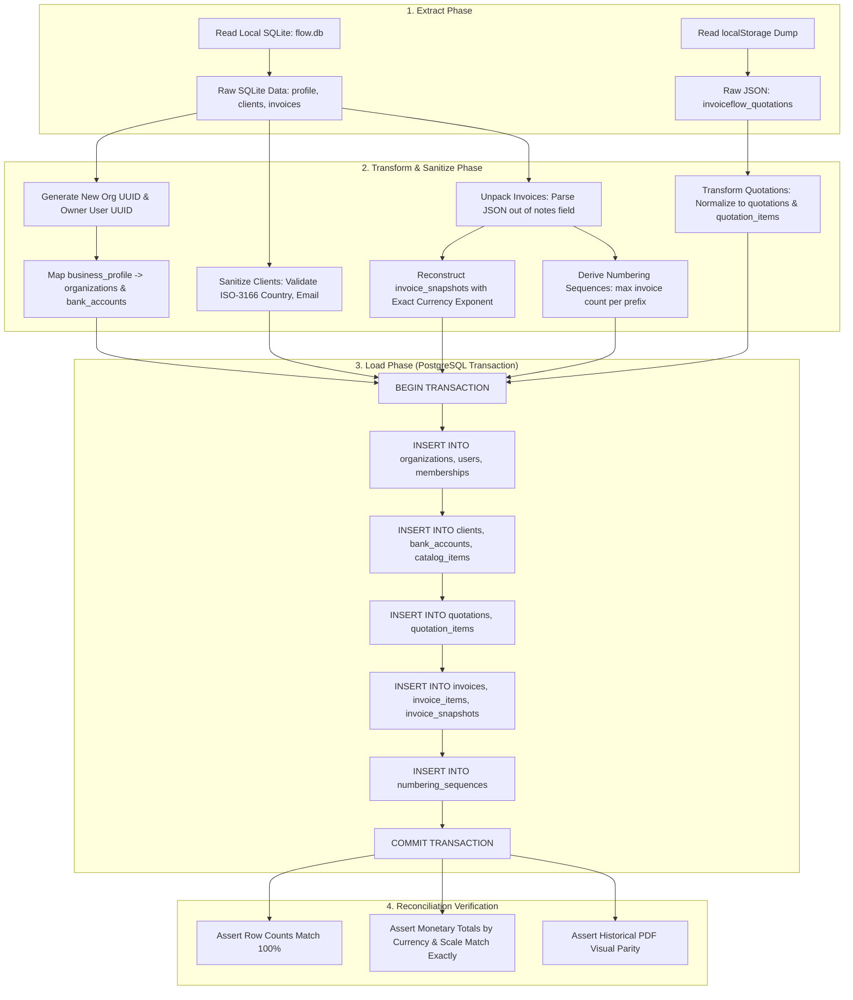
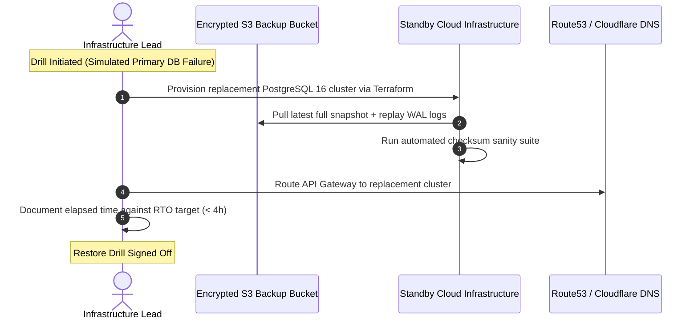

# InvoiceFlow — Migration, Backup/Recovery & Staged Rollout Plan

**Date:** 6 October 2026  
**Auditor:** Antigravity Engineering Agent  
**PRD Version:** 1.0  
**Scope:** Data ETL from Desktop SQLite to Multi-Tenant PostgreSQL, Disaster Recovery Runbooks, and Phased SaaS Deployment.

---

## 1. Desktop SQLite to Cloud PostgreSQL Migration Strategy

### 1.1. Data Source Inventory
The legacy desktop application stores data in two disjoint locations:
1. **Local SQLite (`flow.db`):**
   - `business_profile`: Single company record.
   - `clients`: Customer records without tenant IDs.
   - `invoices`: Invoices with overloaded status strings and JSON embedded in `notes`.
   - `invoice_items`: Flat line item records with missing tax rate foreign keys.
2. **Browser `localStorage` (Desktop Web Shell):**
   - `invoiceflow_quotations`: JSON array of quotation drafts and converted records.

### 1.2. ETL Transformation Pipeline



---

## 2. Detailed Data Transformation Rules

### 2.1. Unpacking the `notes` Field Abuse
In the legacy desktop app, `InvoiceEditor.tsx` serialized custom developer bank details directly into the plain text `notes` column:
```json
// Legacy format embedded in notes column:
"DEVELOPER_BANK_DETAILS: {\"bankName\":\"HDFC\",\"accountNumber\":\"123456\",\"ifsc\":\"HDFC0001\"}\nPROJECT_DETAILS: Website Redesign\nActual customer notes here..."
```
**ETL Parser Logic:**
1. Execute regex pattern extraction to isolate embedded JSON blobs.
2. Extract bank details into a new record in `bank_accounts(organization_id, bank_name, ...)`.
3. Extract project metadata into `invoices.terms_conditions`.
4. Retain only clean user notes in `invoices.notes`.

### 2.2. Backfilling Immutable Snapshots (`invoice_snapshots`)
For all historical invoices with `status != 'Draft'`, the ETL script synthesizes an exact `invoice_snapshots` record:
- Combines the historical `business_profile` values and client details at migration time.
- Records exact currency scale (e.g. `currency_exponent: 2` for USD, `0` for JPY, `3` for KWD).
- Serializes line items, rates, taxes, and totals into `snapshot_payload`.
- Computes SHA-256 checksum: `checksum_sha256 = sha256(snapshot_payload)`.
- Guarantees that subsequent company profile updates in SaaS never alter historical documents (FR-08, FR-28, AC-04).

### 2.3. Initializing Atomic Sequences
The sequence table must be seeded to prevent duplicate number generation on newly created invoices:
$$\text{current\_sequence} = \max(\text{extracted\_sequence\_from\_invoices}) + 1$$
Example: If the legacy database contains `INV-2026-00085`, `numbering_sequences` is initialized with `current_sequence = 85`.

---

## 3. Pre-Migration Verification & Reconciliation Script

```typescript
// scripts/verify-migration-reconciliation.ts
export async function verifyMigration(sqliteDb: Database, pgPool: Pool, orgId: string) {
  console.log("Running reconciliation audit...");

  // 1. Client Count Check
  const sqliteClients = sqliteDb.prepare("SELECT COUNT(*) as c FROM clients").get().c;
  const pgClients = (await pgPool.query("SELECT COUNT(*) as c FROM clients WHERE organization_id = $1", [orgId])).rows[0].c;
  assert.strictEqual(Number(pgClients), sqliteClients, "Client count mismatch!");

  // 2. Invoice Count & Total Financial Sum Check per Currency
  const sqliteInvoices = sqliteDb.prepare(`
    SELECT currency, COUNT(*) as count, SUM(total_amount) as total 
    FROM invoices GROUP BY currency
  `).all();

  for (const row of sqliteInvoices) {
    const pgResult = await pgPool.query(`
      SELECT COUNT(*) as count, SUM(total_amount) as total 
      FROM invoices 
      WHERE organization_id = $1 AND currency = $2 
      GROUP BY currency
    `, [orgId, row.currency]);

    assert.strictEqual(Number(pgResult.rows[0].count), row.count, `Invoice count mismatch for ${row.currency}`);
    assert.strictEqual(Number(pgResult.rows[0].total).toFixed(4), Number(row.total).toFixed(4), `Monetary sum mismatch for ${row.currency}`);
  }

  console.log("SUCCESS: 100% financial and entity parity verified.");
}
```

---

## 4. Disaster Recovery Targets & Restore Runbook

### 4.1. Recovery Objectives (Engineering Targets)
- **Target RPO (Recovery Point Objective):** $\le$ 1 hour (objective to be demonstrated and validated through staging restore drills).
- **Target RTO (Recovery Time Objective):** $\le$ 4 hours (objective to be demonstrated and validated through staging restore drills).

### 4.2. Backup Architecture
1. **Continuous WAL Archiving (Point-in-Time Recovery - PITR):**
   - Write-Ahead Logs continuously streamed to encrypted object storage using `pgBackRest` or AWS RDS automated archiving.
2. **Daily Encrypted Physical Snapshots:**
   - Full PostgreSQL cluster snapshots executed daily at 02:00 UTC with 30-day retention in immutable object storage.
3. **Monthly Archival Backups:**
   - Retained for 7 years for commercial tax compliance.

### 4.3. Disaster Recovery Drill Runbook


---

## 5. Deployment & Rollback Strategy

- **Zero-Downtime Rule (Expand & Contract):** Database migrations must be strictly additive and backward-compatible. Breaking schema changes are deployed across two sequential releases.
- **Rollback Guardrail:** If an application deployment fails health checks, traffic is routed back to the previous container image within 60 seconds. An application rollback must **never** roll back the database schema if new invoices, payments, or client records were created during the deployment window.
