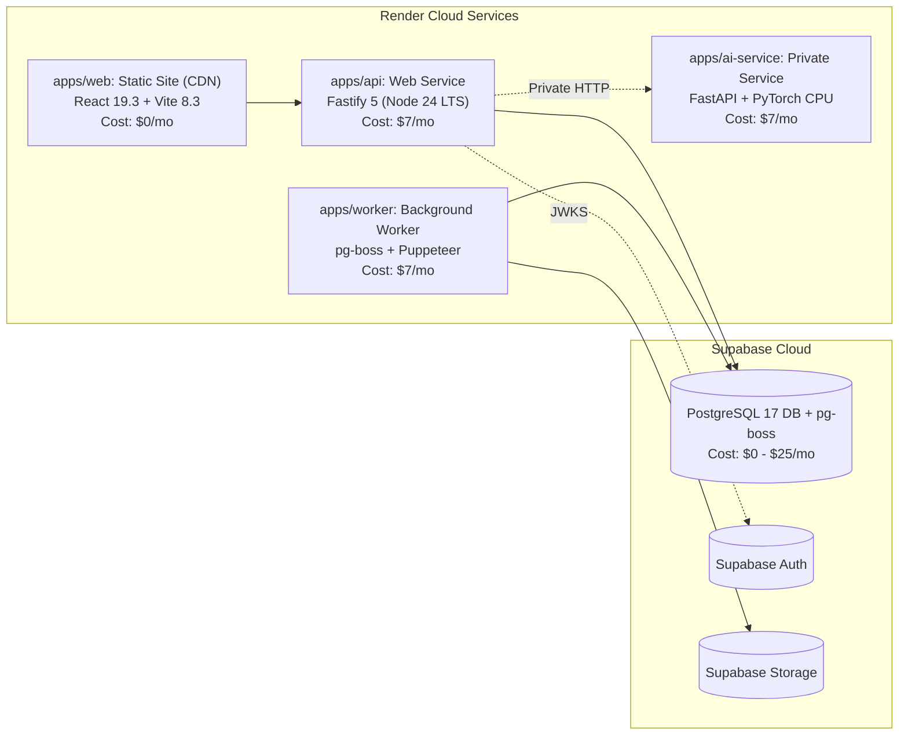

# InvoiceFlow — Target SaaS System Architecture & Design

**Date:** 6 October 2026  
**Auditor:** Antigravity Engineering Agent  
**PRD Version:** 1.0  
**Stack Baseline:** React 19.3 + Vite 8.3 + Node.js 24 LTS + Fastify 5 + Supabase PostgreSQL 17 & Auth + Kysely + pg-boss + Render Hosting

---

## 1. High-Level System Architecture

InvoiceFlow transforms from a single-user Windows desktop application into a modern, cloud-native multi-tenant SaaS.

```mermaid
flowchart TD
    subgraph Clients["Client Tier (Render Static Site)"]
        WebSPA["React 19.3 SPA (Vite 8.3, Tailwind 4.3)"]
        StateManagement["TanStack Query v5 (Server) + Zustand v5 (UI)"]
        PublicPortal["Public Client Portal (Pay / Accept Links)"]
    end

    subgraph Edge["Edge & Ingress Tier"]
        Cloudflare["Cloudflare / Render CDN (WAF, SSL, DDoS)"]
        APIGateway["Render Web Service Ingress"]
    end

    subgraph AppTier["Application Tier (Render Web Service: Node 24 LTS)"]
        FastifyAPI["Fastify 5 API Server"]
        SupabaseAuthMW["Supabase Auth JWT Verification Middleware"]
        TenantContextMW["Kysely Tenant Context Middleware"]
        WebhookIngest["Raw Webhook Ingestion Hook"]
        KyselyCore["Kysely Query Builder (pg.Pool)"]
    end

    subgraph WorkerTier["Background Worker Tier (Render Background Worker)"]
        PgBoss["pg-boss Background Worker Fleet"]
        PDFWorker["Puppeteer (Pinned Chromium) PDF Engine"]
        WebhookReconciler["Webhook Ledger Reconciliation"]
        EmailWorker["Email Reminders & Notifications"]
    end

    subgraph AITier["Private Advisory AI Tier (Render Private Service)"]
        LayaService["Laya Classification Service (Python 3.12, PyTorch CPU)"]
    end

    subgraph DataTier["Managed Data Platform Tier (Supabase)"]
        SupabasePG[(Supabase PostgreSQL 17 with RLS)]
        SupabaseAuth[(Supabase Auth: GoTrue IAM & TOTP MFA)]
        SupabaseStorage[("Supabase Storage: Private Buckets (PDFs, Logos)")]
        PgBossTables[("pgboss.job Table in PostgreSQL 17")]
    end

    subgraph Gateways["Third-Party Gateways"]
        Stripe["Stripe (SaaS Subscriptions & Invoice Checkout)"]
        Razorpay["Razorpay (India Invoicing & UPI)"]
        Tabby["Tabby (UAE/KSA BNPL)"]
    end

    WebSPA --> Cloudflare
    PublicPortal --> Cloudflare
    Cloudflare --> APIGateway
    APIGateway --> FastifyAPI

    FastifyAPI --> SupabaseAuthMW
    SupabaseAuthMW -.->|JWKS / Verify| SupabaseAuth
    FastifyAPI --> TenantContextMW
    TenantContextMW --> KyselyCore
    KyselyCore --> SupabasePG

    FastifyAPI -->|Enqueue Jobs| PgBossTables
    PgBoss -->|SKIP LOCKED| PgBossTables
    PgBoss --> PDFWorker
    PgBoss --> WebhookReconciler
    PgBoss --> EmailWorker

    PDFWorker --> SupabaseStorage
    WebhookReconciler --> KyselyCore

    FastifyAPI -.->|Internal Private HTTP (3s timeout)| LayaService

    Gateways -.->|Raw HMAC Webhooks| WebhookIngest
    WebhookIngest --> SupabasePG
    WebhookIngest -->|Enqueue Reconciliation| PgBossTables
    FastifyAPI -.->|Create Checkout| Gateways
```

---

## 2. Technology Stack & Component Selection

### 2.1. Frontend Tier: React 19.3, Vite 8.3 & Strict State Boundaries
- **Core Framework:** **React 19.3 (`react@19.3.0`)**, **Vite 8.3 (`vite@8.3.3`)**, **Tailwind CSS 4.3 (`tailwindcss@4.3.3`)**.
- **State Management Architecture:**
  - **Server State:** **TanStack Query v5 (`@tanstack/react-query@5.104.1`)** handles all remote data operations: caching, background refetching, request deduplication, optimistic updates, and cache invalidation.
  - **Local UI State:** **Zustand v5 (`zustand@5.0.0`)** is strictly scoped to ephemeral client-only UI state (modal open/closed states, sidebar collapse, active filter drawers, editor field focus). All remote entity stores (clients, invoices, quotations, user profile) are completely eliminated from Zustand.
- **Routing & Typing:** **React Router v7 (`react-router-dom@7.0.0`)** in TypeScript strict mode (`"strict": true`).

---

### 2.2. Backend Tier: Node.js 24 LTS & Fastify 5
- **Runtime Environment:** **Node.js 24 LTS (`v24.18.0`)**. Active LTS line providing optimal performance and V8 execution.
- **Web Server Framework:** **Fastify v5 (`fastify@5.12.5`)**.
- **Performance Targets (PRD Section 20):**
  - Core list/save flows: target p95 latency under 2000ms under representative test load.
  - Internal API processing target < 50ms, subject to benchmark verification.

---

### 2.3. Data Platform & Managed IAM: Supabase
- **Managed PostgreSQL 17:** Current patched platform build managed by Supabase. Provides automated PITR backups, SSL termination, and native Row-Level Security.
- **Authentication & IAM:** **Supabase Auth (`@supabase/supabase-js@2.117.2`)**.
  - Handles user identity, email verification, password reset, OAuth providers, session token rotation, and RFC 6238 TOTP MFA.
  - Generates signed JWTs containing `sub: user_id` and verified user claims.
- **Private Object Storage:** **Supabase Storage**.
  - Dedicated private bucket (`invoiceflow-documents`) for generated invoice PDFs, organization logos, and payment receipts.
  - Protected by RLS policies; assets delivered to users via short-lived signed URLs (15-minute validity).

---

### 2.4. Database Access Layer: Kysely with PostgreSQL Driver
- **Query Builder:** **Kysely (`kysely@0.29.6`)** over **`pg` (`pg@8.13.1`)**.
- **Why Kysely over Prisma:**
  - Kysely provides direct, leak-proof transaction-scoped control over pooled connections:
    ```typescript
    await db.transaction().execute(async (tx) => {
      // Transaction-scoped context on dedicated checked-out connection
      await sql`SET LOCAL app.current_org_id = ${orgId}`.execute(tx);
      const invoices = await tx.selectFrom('invoices').selectAll().execute();
      return invoices;
      // On COMMIT or ROLLBACK, SET LOCAL automatically resets; connection returns clean
    });
    ```

---

### 2.5. Background Queues: `pg-boss` (Queue-in-PostgreSQL)
- **Eliminating Redis:** Background jobs are managed using **`pg-boss` (`pg-boss@12.37.0`)**, running directly inside Supabase PostgreSQL 17.
- **Transactional Enqueueing:** Jobs can be inserted atomically inside the same database transaction that issues an invoice or updates a payment. If the transaction rolls back, the background job is never queued.
- **Worker Process:** Executed in a separate Render Background Worker service (`apps/worker`), ensuring heavy Puppeteer PDF generation and email dispatches never block HTTP API request threads.

---

## 3. Explicit Multi-Tenancy & Row-Level Security (RLS) Design

### 3.1. Authentication & Context Derivation Pipeline
1. Client sends request with `Authorization: Bearer <supabase_jwt>`.
2. Fastify middleware validates JWT signature against Supabase JWKS and extracts `auth.uid` (`user_id`).
3. Middleware queries `organization_memberships` in PostgreSQL to verify that `user_id` has an active membership for the requested organization.
4. If verified, the request enters the Kysely transaction, which executes `SET LOCAL app.current_org_id = $orgId`.

### 3.2. Fail-Closed RLS Kernel Policies
```sql
ALTER TABLE invoices ENABLE ROW LEVEL SECURITY;

CREATE POLICY tenant_isolation_policy ON invoices
    AS RESTRICTIVE
    FOR ALL
    USING (
        organization_id = NULLIF(current_setting('app.current_org_id', true), '')::UUID
    )
    WITH CHECK (
        organization_id = NULLIF(current_setting('app.current_org_id', true), '')::UUID
    );
```
If `app.current_org_id` is missing or uninitialized, `NULLIF` evaluates to `NULL`, the expression evaluates to false, and **zero rows can be read or mutated**.

---

## 4. Transactional Numbering & Retry Rules (FR-27, AC-03)

- **Atomic Sequence Allocation:** Numbers are allocated inside an exclusive transaction holding an advisory lock on `(organization_id, document_type, prefix, financial_year)`.
- **Uniqueness Guarantee:** Enforced by database constraint `UNIQUE (organization_id, invoice_number)`.
- **Gap Realities:** Per PRD FR-27, legally gapless numbering is not promised by default. If a transaction aborts or an invoice is later voided, a sequence gap may exist. The assigned number is never reused.
- **Retry Idempotency:** The issuance endpoint accepts an `Idempotency-Key` header. If a retried request is received with an existing key, the server returns the existing issued invoice without allocating a new number or incrementing the sequence.

---

## 5. Currency-Aware Financial Calculation Engine (`CALC_V1`) (FR-14 to FR-18, AC-05)

- **Library:** **`decimal.js` (`decimal.js@10.6.0`)** using 28-digit fixed-point arithmetic (`ROUND_HALF_UP`).
- **ISO 4217 Currency Scale Awareness:**
  - **0-Decimal Currencies:** JPY, KRW (exponent 0). Rounded to whole integers.
  - **2-Decimal Currencies:** USD, EUR, INR, AED, SAR (exponent 2). Rounded to 2 decimal places.
  - **3-Decimal Currencies:** KWD, BHD, OMR (exponent 3). Preserves 3 decimal places.
- **Database Storage:** Stored in `NUMERIC(18, 4)` across all monetary rate, quantity, and balance columns.

---

## 6. Webhook Ingestion & Durable Acknowledgment (FR-47, FR-48, AC-07)

```mermaid
sequenceDiagram
    autonumber
    participant Gateway as Payment Gateway (Stripe/Razorpay)
    participant Ingest as Fastify Ingestion Hook
    participant DB as Supabase PostgreSQL 17
    participant Boss as pg-boss Job Queue
    participant Worker as Render Background Worker

    Gateway->>Ingest: POST /api/webhooks/stripe (Stripe-Signature, Raw Buffer)
    Note over Ingest: 1. Verify HMAC Signature on Raw Buffer
    alt Invalid Signature
        Ingest-->>Gateway: 400 Bad Request (Discarded)
    else Valid Signature
        Note over Ingest,DB: 2. Durable Database Persistence
        Ingest->>DB: INSERT INTO webhook_events (provider, event_id, payload, status='RECEIVED') ON CONFLICT DO NOTHING
        Ingest->>Boss: Enqueue Job (singletonKey: 'webhook_stripe_' + event_id)
        Ingest-->>Gateway: 200 OK (Acknowledged ONLY after DB commit)
    end

    Note over Worker,DB: 3. Asynchronous Worker Ledger Reconciliation
    Worker->>Boss: Dequeue Job via SKIP LOCKED
    Worker->>DB: BEGIN TRANSACTION; SET LOCAL app.current_org_id = $orgId;
    Worker->>DB: Insert Payment & Allocations; Recalculate Invoice Balances;
    Worker->>DB: UPDATE webhook_events SET status = 'PROCESSED', processed_at = NOW();
    Worker->>DB: COMMIT TRANSACTION;
```

---

## 7. Containerized PDF Worker & Scan-Tested QR Codes (FR-31 to FR-36, AC-13)

- **PDF Engine:** **Puppeteer (`puppeteer@25.12.0`)** with pinned Chromium binary.
- **Font & RTL Shaping:** Pre-installed Google Noto fonts (`noto-fonts-core`, `noto-fonts-arabic`, `noto-fonts-malayalam`, `noto-fonts-devanagari`) supporting BiDi text shaping for Arabic and RTL scripts.
- **QR Barcodes:** Standard `qrcode` library generating verified 2D barcodes for India UPI, European EPC-QR, or public document verification URLs.
- **Asset Storage:** Output PDFs uploaded to Supabase Storage with signed URL access.

---

## 8. Private Advisory Laya AI Service (FR-65 to FR-72, AC-12)

- **Hosting & Network:** Deployed as a **Render Private Service** (Python 3.12, FastAPI, PyTorch CPU) accessible strictly over internal private networking (`http://ai-service.internal:8000`).
- **Advisory Role:** Strictly unprivileged classification and routing engine. It cannot confirm payments, issue invoices, or modify financial records.
- **Bounded Timeout & Fallback:** Hard **3000ms timeout**. If the service times out or errors, the Fastify API immediately falls back to standard manual UI with zero impact on core invoicing.

---

## 9. Render + Supabase Deployment Topology


