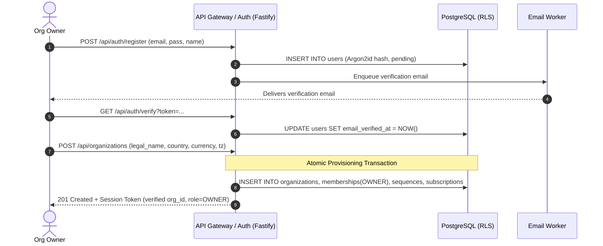
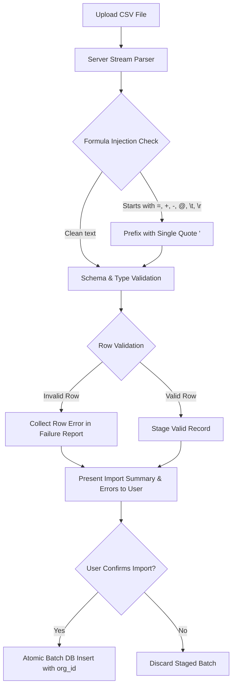
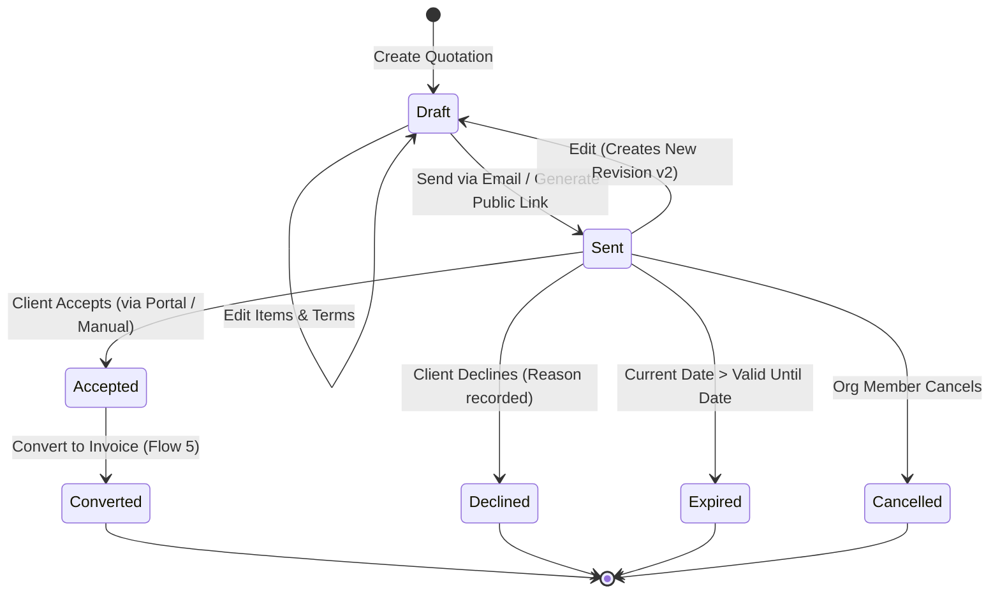
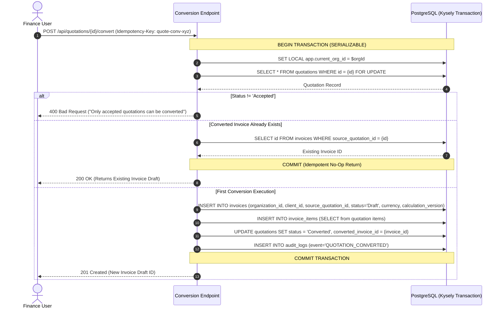
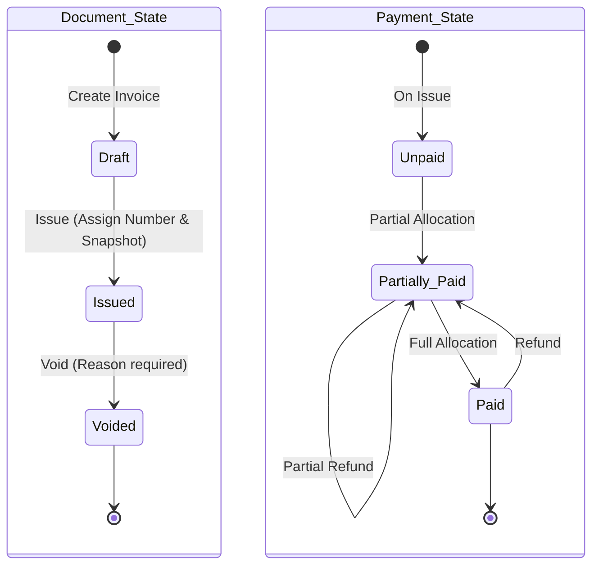
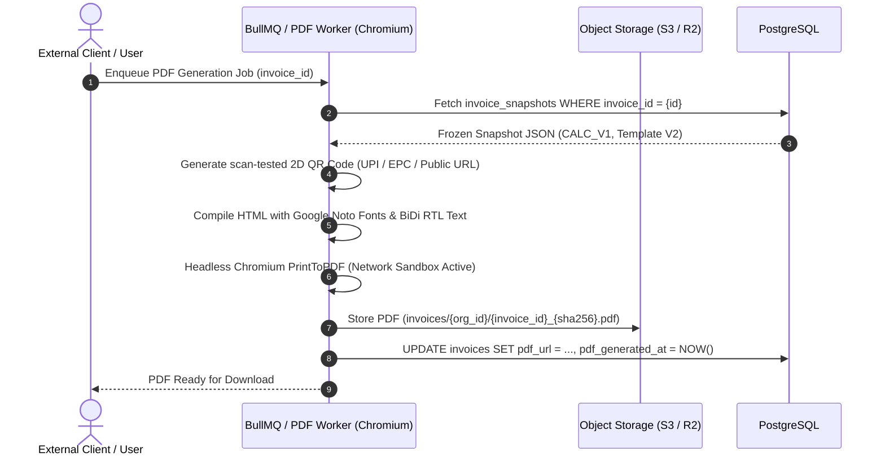
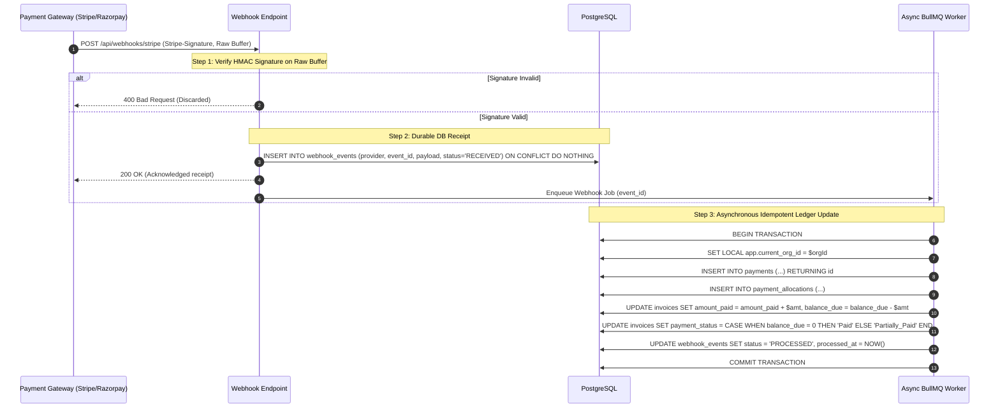
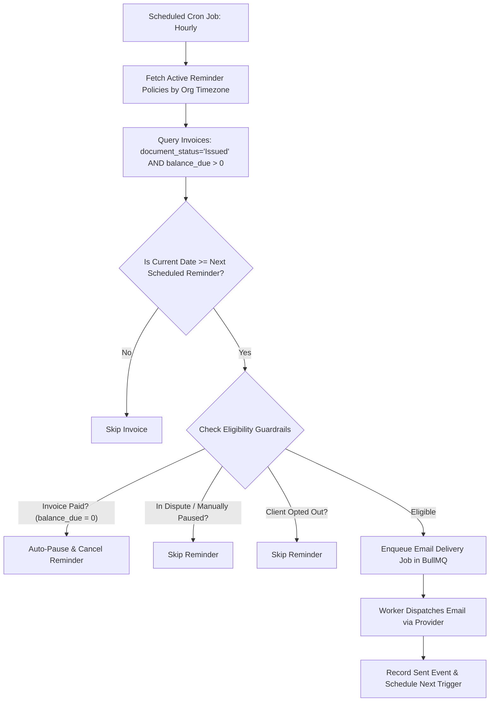
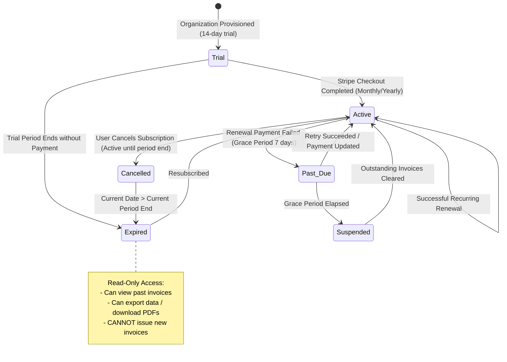
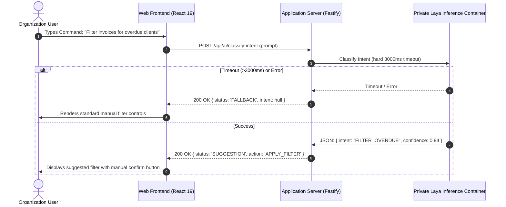

# InvoiceFlow — Comprehensive SaaS User Flows & State Machines

**Date:** 6 October 2026  
**Auditor:** Antigravity Engineering Agent  
**PRD Version:** 1.0  
**Scope:** Complete lifecycle specifications, state transitions, validation rules, and error recovery flows for target production SaaS.

---

## 1. Flow 1: Tenant Onboarding & Multi-Tenant Provisioning

### Actors
- **User (Prospective Organization Owner)**
- **Auth Service & API Gateway (Node.js 22 LTS / Fastify)**
- **PostgreSQL 16 Database (with Row-Level Security)**

### Pre-conditions
- User accesses InvoiceFlow web app without an active session.

### Step-by-Step Flow
1. **User Registration / Sign Up:**
   - User submits `email`, `password` (hashed via Argon2id), and `full_name`.
   - API creates unverified record in `users` table; sends verification email with signed cryptographic token.
2. **Email Verification:**
   - User clicks verification link; API validates token and marks `email_verified_at = NOW()`.
3. **Organization Profile Setup (FR-04, FR-05):**
   - User inputs organization legal identity:
     - Legal Name & Display Name
     - Business Country (e.g. `IN`)
     - Tax Identifiers (e.g. GSTIN, PAN, VAT, EIN)
     - Base Currency (e.g. `INR`) and Reporting Currency
     - Document Language (`en`, `ar`, `ml`, etc.)
     - Timezone (e.g. `Asia/Kolkata`) and Financial Year Start (e.g. April 1)
     - Initial Invoice Prefix (e.g. `INV`)
4. **Atomic Provisioning Transaction:**
   - System executes single database transaction under the application role:
     ```sql
     INSERT INTO organizations (...) RETURNING id;
     INSERT INTO organization_memberships (user_id, organization_id, role) VALUES (..., 'OWNER');
     INSERT INTO numbering_sequences (organization_id, document_type, prefix, financial_year, current_sequence) VALUES (..., 'INVOICE', 'INV', '2026-2027', 0);
     INSERT INTO subscriptions (organization_id, plan_id, status, trial_ends_at) VALUES (..., 'PRO_PLAN', 'TRIAL', NOW() + INTERVAL '14 days');
     ```
5. **Session Issuance & Context Binding:**
   - Server issues a cryptographically secure session cookie (or JWT) containing `user_id` and verified `org_id`.
   - Tenant context for subsequent requests is **strictly derived from validated membership**, never from raw unverified client headers.
   - User is routed directly to Organization Dashboard.



---

## 2. Flow 2: International Settings & Orthogonal Fallback Rules

### Key Principle (FR-05)
Business Country, Client Country, Tax Jurisdiction, Currency, Language, Locale, and Timezone are strictly decoupled. Setting a country suggests defaults, but never silently mutates other preferences.

### Step-by-Step Flow
1. **Accessing Settings:**
   - Owner or Admin navigates to `/settings/international`.
2. **Updating Preferences:**
   - User modifies preferences (e.g. changes `default_invoice_currency` from `INR` to `USD` for export billing while maintaining `business_country = 'IN'`).
3. **Validation & Capability Check (FR-06, FR-07):**
   - Backend checks capability matrix:
     - Is `USD` supported for invoice generation? -> **Yes**.
     - Is e-invoicing mandated for export invoices? -> System displays contextual statutory advisory ("Notice: Cross-border invoices require export LUT declaration under Indian GST").
4. **Saving Settings:**
   - API updates `organizations` table within a transaction setting `SET LOCAL app.current_org_id`.
5. **Snapshot Decoupling Enforcement (FR-08):**
   - Historical invoices and quotations remain untouched.
   - Future drafts inherit updated defaults; existing drafts show an optional "Update defaults" banner.

---

## 3. Flow 3: Client & Catalog Management with Formula-Safe CSV Import/Export

### Client Creation & Search (FR-09, FR-10, FR-11)
1. **Client Management:**
   - User creates client with billing address, currency preference, tax identifier, and payment terms.
   - Client search utilizes PostgreSQL `tsvector` full-text search across name, company, email, and tax ID within tenant context.
2. **Currency-Isolated Balances (FR-10):**
   - Client detail view renders isolated balance cards:
     - `USD Balance: $1,200.00`
     - `INR Balance: ₹45,000.00`
     - `KWD Balance: 350.000 KD`
   - Currency totals are never summed together.

### Formula-Safe CSV Import & Export (FR-13)


---

## 4. Flow 4: Quotation Lifecycle, Public Client Portal & Revisioning

### State Machine (FR-20)


### Detailed Flow
1. **Drafting (FR-19):**
   - Member inputs client, validity date, line items, item discounts, tax configuration, and terms.
   - System calculates subtotals using server-side Decimal rules (`CALC_V1`) respecting currency exponent.
   - Saved with status `Draft`, `revision_number = 1`.
2. **Sending & Revision Locking (FR-21):**
   - Member clicks "Send Quotation".
   - System generates cryptographically secure 256-bit public token in `shared_links`.
   - Quotation status transitions to `Sent`. The record content is locked into an immutable revision snapshot.
3. **Client Public View:**
   - External client opens `https://app.invoiceflow.com/portal/quote/{token}`.
   - Rate limiter validates request; audit log records `PUBLIC_VIEW_ACCESSED` with client IP.
   - Portal displays line items, terms, and action buttons: **[Accept Quotation]** / **[Decline Quotation]**.
4. **Client Acceptance / Decline:**
   - If Client clicks **[Accept]**:
     - Client enters name/title and electronic confirmation.
     - System updates status to `Accepted`, sets `accepted_at = NOW()`, records client confirmation metadata.
     - Notification dispatched to organization owner/finance team.
   - If Client clicks **[Decline]**:
     - Client enters optional reason. Status updates to `Declined`.

---

## 5. Flow 5: Transaction-Safe Quotation-to-Invoice Conversion (FR-22, FR-23, FR-24, AC-02)

### Concurrency & Idempotency Guarantee
To prevent duplicate invoice creation during rapid double-clicks or retried network requests, conversion executes inside a PostgreSQL `SERIALIZABLE` transaction utilizing advisory locks on `(quotation_id)`.



---

## 6. Flow 6: Invoice Lifecycle, Concurrent Numbering & Immutable Issuance

### State Machine (FR-26)


### Numbering Rules, Uniqueness & Gap Realities (FR-27, AC-03)
- **Concurrency Collision Guard:** Numbers are allocated atomically inside a dedicated transaction holding an exclusive advisory lock on `(organization_id, document_type, prefix, financial_year)`.
- **Gap Realities:** Per PRD FR-27, legally gapless numbering is not promised by default. If an issuance transaction aborts or rolls back due to a downstream failure, or if an issued invoice is later voided, a sequence gap may exist. The assigned number is never retroactively reassigned.
- **Uniqueness Guarantee:** Enforced by database constraint `UNIQUE (organization_id, invoice_number)`.
- **Idempotency on Retry:** Requests supplying an `Idempotency-Key` check for an existing issued document. If already issued, the server returns the existing invoice without incrementing the sequence.

### Atomic Issuance Procedure (FR-28, AC-04)
1. **Triggering Issue:**
   - User reviews draft invoice and clicks **[Issue Invoice]**.
2. **Transaction Execution:**
   ```sql
   BEGIN;
   SET LOCAL app.current_org_id = $org_id;
   
   -- Acquire transaction-scoped advisory lock for this org & FY sequence
   SELECT pg_advisory_xact_lock(hashtext('org_' || $org_id || '_seq_INV_' || $fy));
   
   -- Increment and fetch next sequence number
   UPDATE numbering_sequences 
   SET current_sequence = current_sequence + 1 
   WHERE organization_id = $org_id AND prefix = 'INV' AND financial_year = $fy
   RETURNING current_sequence;
   
   -- Freeze full document snapshot
   INSERT INTO invoice_snapshots (invoice_id, organization_id, snapshot_payload, checksum_sha256)
   VALUES ($invoice_id, $org_id, $json_payload, $hash);
   
   -- Transition document state
   UPDATE invoices 
   SET document_status = 'Issued', invoice_number = $generated_number, issued_at = NOW(), balance_due = total_amount
   WHERE id = $invoice_id;
   
   COMMIT;
   ```
3. **Subsequent Modifications:**
   - Any later edits to organization profile, client contact details, or bank IBANs have **zero impact** on this issued invoice.

---

## 7. Flow 7: PDF Generation, QR Code Engine & Scoped Public Sharing



---

## 8. Flow 8: Payment Collection via Provider Gateways (Stripe, Razorpay, Tabby)

### Core Invariant & Webhook Ingestion Pipeline (FR-47, FR-48, AC-07)
**A client browser redirect, frontend success message, or uploaded payment receipt NEVER marks an invoice paid.** Invoices are marked paid strictly by verified server-to-server webhooks or authorized manual finance review.

1. **Ingestion Verification:** Raw request buffer signature is verified using provider HMAC secret BEFORE payload is trusted.
2. **Durable Receipt:** Raw event is written to `webhook_events (provider, event_id, payload)` before returning HTTP 200 OK.
3. **Async Processing:** Webhook worker dequeues event, verifies idempotency, updates ledger, and recalculates invoice balances.



---

## 9. Flow 9: Manual Payment Records, Allocations & Reversals (FR-43, FR-44, AC-06)

1. **Manual Record Entry:** Finance user enters amount, payment method, date, and reference.
2. **Currency Matching Validation (FR-45):** Recorded payment currency must match invoice currency.
3. **Atomic Balance Updates:**
   $$\text{balance\_due} = \text{total\_amount} - \text{amount\_paid}$$
4. **Reversal / Refund Workflow:** If a payment bounced or was refunded, creating a compensating reversal updates `amount_paid` and `balance_due` transactionally.

---

## 10. Flow 10: Reminder Engine & Intelligent Auto-Pause



---

## 11. Flow 11: Multi-Currency Reporting & Analytics Isolation (FR-55, FR-56, FR-57, AC-08)

- **Isolated Currency Cards:** Reports render metrics grouped strictly by currency (USD, INR, KWD, JPY).
- **Scale-Aware Display:**
  - JPY displays 0 decimal places (`¥150,000`).
  - USD/INR displays 2 decimal places (`$1,250.00`, `₹95,000.00`).
  - KWD displays 3 decimal places (`350.000 KD`).
- **Zero Cross-Currency Blending:** Unrelated currencies are never summed together without an auditable conversion policy.

---

## 12. Flow 12: Single-Plan SaaS Subscription Lifecycle (FR-59 to FR-64, AC-10)



---

## 13. Flow 13: Laya Classification & Advisory Intent Flow (FR-65 to FR-72, AC-12)

### Strict Operational Principles
- **Advisory Only:** Laya is strictly an unprivileged decision/classification assistant. It cannot execute financial mutations.
- **Runtime & Timeout:** Executes in an isolated Python 3.11 / ONNX container with a hard **3000ms timeout**.
- **Graceful Manual Fallback:** If Laya times out, returns an error, or is disabled, the frontend displays standard manual form controls with zero disruption to invoicing.
- **No Autonomous Fallback:** No external generative LLM is invoked as a fallback without an explicit product decision.


